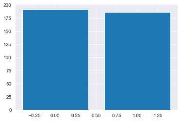
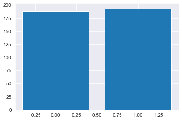
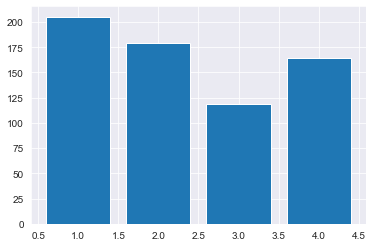
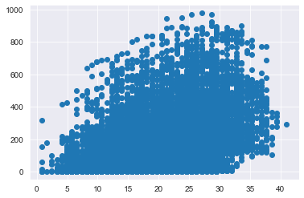
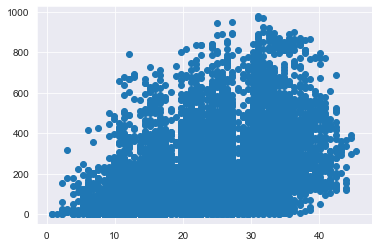
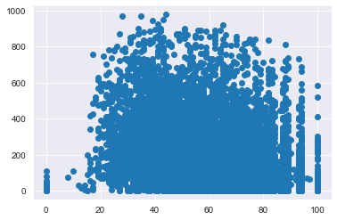
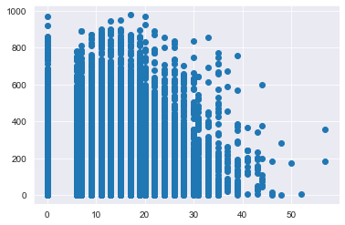
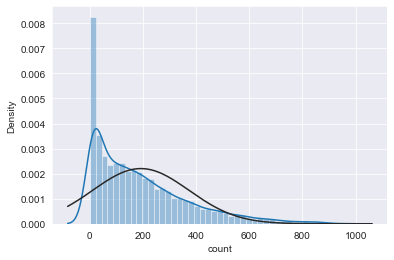
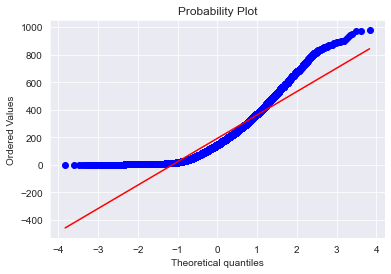
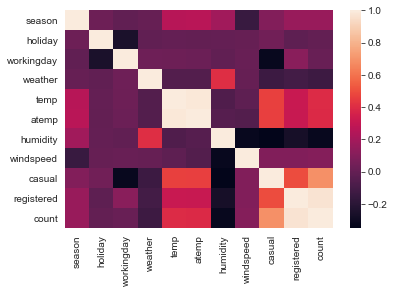

---
layout : single
title : Data 분석과정 Mini PJT 
--- 

## 자전거 대여량 예측 문제 정의 

워싱턴 D.C 소재의 자전거 대여 스타트업 Capital Bikeshare의 데이터를 활용하여, 특정 시간대에 얼마나 많은 사람들이 자전거를 대여하는지 예측하는 것이 목표입니다.

사람들이 자전거를 대여하는데는 많은 요소가 관여되어 있을 겁니다. 가령 **시간(새벽보다 낮에 많이 빌리겠죠)**, **날씨(비가 오면 자전거를 대여하지 않을 겁니다), 근무일(근무 시간에는 자전거를 대여하지 않겠죠)** 등. 이런 모든 요소를 조합하여 워싱턴 D.C의 자전거 교통량을 예측해주세요.

## 데이터 설명

#### 파일 구조
- train.csv
    - 학습을 위하여 활용되는 데이터 셋입니다. 10886열
- test.csv
    - 평가를 위하여 제공되는 데이터 셋입니다. 6493열
- submission.csv
    - test.csv 파일을 예측한 결과를 submission 파일에 작성한 후 제출합니다.
    
#### 컬럼 구조 (9개의 Features / 3개의 결과값) 
  * **datetime** - 시간. 연-월-일 시:분:초 로 표현합니다. (가령 2011-01-01 00:00:00은 2011년 1월 1일 0시 0분 0초)
  * **season** - 계절. 봄(1), 여름(2), 가을(3), 겨울(4) 순으로 표현합니다.
  * **holiday** - 공휴일. 1이면 공휴일이며, 0이면 공휴일이 아닙니다.
  * **workingday** - 근무일. 1이면 근무일이며, 0이면 근무일이 아닙니다.
  * **weather** - 날씨. 1 ~ 4 사이의 값을 가지며, 구체적으로는 다음과 같습니다.
    * 1: 아주 깨끗한 날씨입니다. 또는 아주 약간의 구름이 끼어있습니다.
    * 2: 약간의 안개와 구름이 끼어있는 날씨입니다.
    * 3: 약간의 눈, 비가 오거나 천둥이 칩니다.
    * 4: 아주 많은 비가 오거나 우박이 내립니다.
  * **temp** - 온도. 섭씨(Celsius)로 적혀있습니다.
  * **atemp** - 체감 온도. 마찬가지로 섭씨(Celsius)로 적혀있습니다.
  * **humidity** - 습도.
  * **windspeed** - 풍속.
  * **casual** - 비회원(non-registered)의 자전거 대여량.
  * **registered** - 회원(registered)의 자전거 대여량.
  * **count** - 총 자전거 대여랑. 비회원(casual) + 회원(registered)과 동일합니다.
  
## 프로젝트 구성
* 데이터 로드 (load data, train.csv, test.csv)
* 데이터 전처리 및 특성 공학 (train.csv, test.csv)
* 모델 생성 및 검증 (train.csv)
* 평가 데이터 예측 (test.csv)
* 결과 제출 및 점수 확인

```python
# 성능 평가 함수
from sklearn.metrics import mean_squared_log_error
def rmsle(true, pred):
    return np.sqrt(mean_squared_log_error(true, pred)) 
```


## **박민우님 '부동산 가격 예측 파일럿 모델링' Code를 참고하여 작성**

## 모듈 import 

필요한 모듈을 import 합니다. 필요에 따라 추가 패키지를 load 할 수 있습니다.


```python
import os
import datetime
import numpy as np
import pandas as pd
import seaborn as sns
import matplotlib.pyplot as plt #시각화
import seaborn as sns
color = sns.color_palette()
sns.set_style('darkgrid')

from scipy import stats # 통계 분석 툴
from scipy.stats import norm,skew

%matplotlib inline

# Data 경로 설정
DATA_DIR = 'data'

# train 데이터셋 로드 (train.csv)
train = pd.read_csv(os.path.join(DATA_DIR, project_name, 'train.csv'))
                                 
# test 데이터셋 로드 (test.csv)
test = pd.read_csv(os.path.join(DATA_DIR, project_name, 'test.csv'))

# submission 파일 로드 (submission.csv)
submission = pd.read_csv(os.path.join(DATA_DIR, project_name, 'submission.csv'))
```

2개의 데이터 셋트를 나누어 제공합니다.

1. train: 학습용 데이터 세트. 정답 값이라고 할 수 있는 `label` 값이 같이 제공됩니다.
2. test: 예측용 데이터 세트. 정답 값이 빠진 `feature` 들만 제공됩니다. 우리는 이 `feature`를 활용하여 예측을 진행합니다.
3. submission: 정답 제출용 데이터 세트. 주어진 형식에 맞춰 정답 값을 기입하고 제출합니다.

## 1. 데이터 전처리


```python
# 학습 데이터 조회
train.head(5)
```


<div>
<style scoped>
    .dataframe tbody tr th:only-of-type {
        vertical-align: middle;
    }

    .dataframe tbody tr th {
        vertical-align: top;
    }

    .dataframe thead th {
        text-align: right;
    }
</style>
<table border="1" class="dataframe">
  <thead>
    <tr style="text-align: right;">
      <th></th>
      <th>datetime</th>
      <th>season</th>
      <th>holiday</th>
      <th>workingday</th>
      <th>weather</th>
      <th>temp</th>
      <th>atemp</th>
      <th>humidity</th>
      <th>windspeed</th>
      <th>casual</th>
      <th>registered</th>
      <th>count</th>
    </tr>
  </thead>
  <tbody>
    <tr>
      <th>0</th>
      <td>2011-01-01 00:00:00</td>
      <td>1</td>
      <td>0</td>
      <td>0</td>
      <td>1</td>
      <td>9.84</td>
      <td>14.395</td>
      <td>81</td>
      <td>0.0</td>
      <td>3</td>
      <td>13</td>
      <td>16</td>
    </tr>
    <tr>
      <th>1</th>
      <td>2011-01-01 01:00:00</td>
      <td>1</td>
      <td>0</td>
      <td>0</td>
      <td>1</td>
      <td>9.02</td>
      <td>13.635</td>
      <td>80</td>
      <td>0.0</td>
      <td>8</td>
      <td>32</td>
      <td>40</td>
    </tr>
    <tr>
      <th>2</th>
      <td>2011-01-01 02:00:00</td>
      <td>1</td>
      <td>0</td>
      <td>0</td>
      <td>1</td>
      <td>9.02</td>
      <td>13.635</td>
      <td>80</td>
      <td>0.0</td>
      <td>5</td>
      <td>27</td>
      <td>32</td>
    </tr>
    <tr>
      <th>3</th>
      <td>2011-01-01 03:00:00</td>
      <td>1</td>
      <td>0</td>
      <td>0</td>
      <td>1</td>
      <td>9.84</td>
      <td>14.395</td>
      <td>75</td>
      <td>0.0</td>
      <td>3</td>
      <td>10</td>
      <td>13</td>
    </tr>
    <tr>
      <th>4</th>
      <td>2011-01-01 04:00:00</td>
      <td>1</td>
      <td>0</td>
      <td>0</td>
      <td>1</td>
      <td>9.84</td>
      <td>14.395</td>
      <td>75</td>
      <td>0.0</td>
      <td>0</td>
      <td>1</td>
      <td>1</td>
    </tr>
  </tbody>
</table>
</div>


```python
# 평가 데이터 조회
test.head(5)
```


<div>
<style scoped>
    .dataframe tbody tr th:only-of-type {
        vertical-align: middle;
    }

    .dataframe tbody tr th {
        vertical-align: top;
    }

    .dataframe thead th {
        text-align: right;
    }
</style>
<table border="1" class="dataframe">
  <thead>
    <tr style="text-align: right;">
      <th></th>
      <th>datetime</th>
      <th>season</th>
      <th>holiday</th>
      <th>workingday</th>
      <th>weather</th>
      <th>temp</th>
      <th>atemp</th>
      <th>humidity</th>
      <th>windspeed</th>
    </tr>
  </thead>
  <tbody>
    <tr>
      <th>0</th>
      <td>2011-01-20 00:00:00</td>
      <td>1</td>
      <td>0</td>
      <td>1</td>
      <td>1</td>
      <td>10.66</td>
      <td>11.365</td>
      <td>56</td>
      <td>26.0027</td>
    </tr>
    <tr>
      <th>1</th>
      <td>2011-01-20 01:00:00</td>
      <td>1</td>
      <td>0</td>
      <td>1</td>
      <td>1</td>
      <td>10.66</td>
      <td>13.635</td>
      <td>56</td>
      <td>0.0000</td>
    </tr>
    <tr>
      <th>2</th>
      <td>2011-01-20 02:00:00</td>
      <td>1</td>
      <td>0</td>
      <td>1</td>
      <td>1</td>
      <td>10.66</td>
      <td>13.635</td>
      <td>56</td>
      <td>0.0000</td>
    </tr>
    <tr>
      <th>3</th>
      <td>2011-01-20 03:00:00</td>
      <td>1</td>
      <td>0</td>
      <td>1</td>
      <td>1</td>
      <td>10.66</td>
      <td>12.880</td>
      <td>56</td>
      <td>11.0014</td>
    </tr>
    <tr>
      <th>4</th>
      <td>2011-01-20 04:00:00</td>
      <td>1</td>
      <td>0</td>
      <td>1</td>
      <td>1</td>
      <td>10.66</td>
      <td>12.880</td>
      <td>56</td>
      <td>11.0014</td>
    </tr>
  </tbody>
</table>
</div>


```python
type(train),type(test),train.shape, test.shape
```


    (pandas.core.frame.DataFrame,
     pandas.core.frame.DataFrame,
     (10886, 12),
     (6493, 9))


## 1-1. x 독립변수 분석 (category형 독립변수)


```python
import matplotlib.pyplot as plt
import matplotlib.font_manager as fm

font_path = r'C:\Users\admin\Downloads\Roboto\Roboto-Regular.tft'
fontprop = fm.FontProperties(fname=font_path,size=18)

```


```python
train.keys()
```


    Index(['datetime', 'season', 'holiday', 'workingday', 'weather', 'temp',
           'atemp', 'humidity', 'windspeed', 'casual', 'registered', 'count'],
          dtype='object')


```python
# gropu by로 분석 
# pivot_table & plt.bar graph로 시각화
```


```python
train.pivot_table(index='season',values='count') # 'season', 'holiday', 'workingday', 'weather'
```


<div>
<style scoped>
    .dataframe tbody tr th:only-of-type {
        vertical-align: middle;
    }

    .dataframe tbody tr th {
        vertical-align: top;
    }

    .dataframe thead th {
        text-align: right;
    }
</style>
<table border="1" class="dataframe">
  <thead>
    <tr style="text-align: right;">
      <th></th>
      <th>count</th>
    </tr>
    <tr>
      <th>season</th>
      <th></th>
    </tr>
  </thead>
  <tbody>
    <tr>
      <th>1</th>
      <td>116.343261</td>
    </tr>
    <tr>
      <th>2</th>
      <td>215.251372</td>
    </tr>
    <tr>
      <th>3</th>
      <td>234.417124</td>
    </tr>
    <tr>
      <th>4</th>
      <td>198.988296</td>
    </tr>
  </tbody>
</table>
</div>


```python
plt.bar(train.pivot_table(index='season',values='count').index,train.pivot_table(index='season',values='count').values.flatten())
```


    <BarContainer object of 4 artists>


    

    


```python
train.pivot_table(index='holiday',values='count')
```


<div>
<style scoped>
    .dataframe tbody tr th:only-of-type {
        vertical-align: middle;
    }

    .dataframe tbody tr th {
        vertical-align: top;
    }

    .dataframe thead th {
        text-align: right;
    }
</style>
<table border="1" class="dataframe">
  <thead>
    <tr style="text-align: right;">
      <th></th>
      <th>count</th>
    </tr>
    <tr>
      <th>holiday</th>
      <th></th>
    </tr>
  </thead>
  <tbody>
    <tr>
      <th>0</th>
      <td>191.741655</td>
    </tr>
    <tr>
      <th>1</th>
      <td>185.877814</td>
    </tr>
  </tbody>
</table>
</div>


```python
plt.bar(train.pivot_table(index='holiday',values='count').index,train.pivot_table(index='holiday',values='count').values.flatten())
```


    <BarContainer object of 2 artists>


    

    


```python
train.pivot_table(index='workingday',values='count')
```


<div>
<style scoped>
    .dataframe tbody tr th:only-of-type {
        vertical-align: middle;
    }

    .dataframe tbody tr th {
        vertical-align: top;
    }

    .dataframe thead th {
        text-align: right;
    }
</style>
<table border="1" class="dataframe">
  <thead>
    <tr style="text-align: right;">
      <th></th>
      <th>count</th>
    </tr>
    <tr>
      <th>workingday</th>
      <th></th>
    </tr>
  </thead>
  <tbody>
    <tr>
      <th>0</th>
      <td>188.506621</td>
    </tr>
    <tr>
      <th>1</th>
      <td>193.011873</td>
    </tr>
  </tbody>
</table>
</div>


```python
plt.bar(train.pivot_table(index='workingday',values='count').index,train.pivot_table(index='workingday',values='count').values.flatten())
```


    <BarContainer object of 2 artists>


    

    


```python
train.pivot_table(index='weather',values='count')
```


<div>
<style scoped>
    .dataframe tbody tr th:only-of-type {
        vertical-align: middle;
    }

    .dataframe tbody tr th {
        vertical-align: top;
    }

    .dataframe thead th {
        text-align: right;
    }
</style>
<table border="1" class="dataframe">
  <thead>
    <tr style="text-align: right;">
      <th></th>
      <th>count</th>
    </tr>
    <tr>
      <th>weather</th>
      <th></th>
    </tr>
  </thead>
  <tbody>
    <tr>
      <th>1</th>
      <td>205.236791</td>
    </tr>
    <tr>
      <th>2</th>
      <td>178.955540</td>
    </tr>
    <tr>
      <th>3</th>
      <td>118.846333</td>
    </tr>
    <tr>
      <th>4</th>
      <td>164.000000</td>
    </tr>
  </tbody>
</table>
</div>


```python
plt.bar(train.pivot_table(index='weather',values='count').index,train.pivot_table(index='weather',values='count').values.flatten())
```


    <BarContainer object of 4 artists>


    

    


## 1-1. x 독립변수 분석 (Data형 독립변수)


```python
fig, ax = plt.subplots() # figure 와 axis 표시 가능 # nrows= ncols= 
ax.scatter(x=train['temp'], y=train['count']) # 0과1로 표시된 Data가 아닌 것에 적합
plt.show
```


    <function matplotlib.pyplot.show(close=None, block=None)>


    

    


```python
fig, ax = plt.subplots() # figure 와 axis 표시 가능 # nrows= ncols= 
ax.scatter(x=train['atemp'], y=train['count']) # 0과1로 표시된 Data가 아닌 것에 적합
plt.show
```


    <function matplotlib.pyplot.show(close=None, block=None)>


    

    


```python
fig, ax = plt.subplots() # figure 와 axis 표시 가능 # nrows= ncols= 
ax.scatter(x=train['humidity'], y=train['count']) # 0과1로 표시된 Data가 아닌 것에 적합
plt.show
```


    <function matplotlib.pyplot.show(close=None, block=None)>


    

    


```python
fig, ax = plt.subplots() # figure 와 axis 표시 가능 # nrows= ncols= 
ax.scatter(x=train['windspeed'], y=train['count']) # 0과1로 표시된 Data가 아닌 것에 적합
plt.show
```


    <function matplotlib.pyplot.show(close=None, block=None)>


    

    


## 1-2 y 종속변수 분석 (대여량)


```python
sns.distplot(train['count'], fit=norm) # y 종속 변수 분포 확인 , https://rudolf-2434.tistory.com/9 #diplot과 distplot 차이 있음
```

    C:\ProgramData\Anaconda3\lib\site-packages\seaborn\distributions.py:2557: FutureWarning: `distplot` is a deprecated function and will be removed in a future version. Please adapt your code to use either `displot` (a figure-level function with similar flexibility) or `histplot` (an axes-level function for histograms).
      warnings.warn(msg, FutureWarning)
    


    <AxesSubplot:xlabel='count', ylabel='Density'>


    

    


```python
(mu, sigma) = norm.fit(train['count'])
print(mu,sigma) # mu 평균값 sigma 표준편차

fig = plt.figure() 
res = stats.probplot(train['count'],plot=plt)   #QQ Plot (Quantile-Quantile Plot, 두변수간의 분포를 비교하기 위해 사용되는 Graph)
plt.show()
```

    191.57413191254824 181.1361335742659
    


    

    


* **좌측으로 편향된 왜곡분포를 보이므로 선형회귀분석을 위해서 정규분포로 데이터 정규화하면 더 좋은 결과를 얻을 수 있음**

## 1-3 결측치 확인


```python
ntrain = train.shape[0]
ntest = test.shape[0]
```


```python
train.head()
```


<div>
<style scoped>
    .dataframe tbody tr th:only-of-type {
        vertical-align: middle;
    }

    .dataframe tbody tr th {
        vertical-align: top;
    }

    .dataframe thead th {
        text-align: right;
    }
</style>
<table border="1" class="dataframe">
  <thead>
    <tr style="text-align: right;">
      <th></th>
      <th>datetime</th>
      <th>season</th>
      <th>holiday</th>
      <th>workingday</th>
      <th>weather</th>
      <th>temp</th>
      <th>atemp</th>
      <th>humidity</th>
      <th>windspeed</th>
      <th>casual</th>
      <th>registered</th>
      <th>count</th>
    </tr>
  </thead>
  <tbody>
    <tr>
      <th>0</th>
      <td>2011-01-01 00:00:00</td>
      <td>1</td>
      <td>0</td>
      <td>0</td>
      <td>1</td>
      <td>9.84</td>
      <td>14.395</td>
      <td>81</td>
      <td>0.0</td>
      <td>3</td>
      <td>13</td>
      <td>16</td>
    </tr>
    <tr>
      <th>1</th>
      <td>2011-01-01 01:00:00</td>
      <td>1</td>
      <td>0</td>
      <td>0</td>
      <td>1</td>
      <td>9.02</td>
      <td>13.635</td>
      <td>80</td>
      <td>0.0</td>
      <td>8</td>
      <td>32</td>
      <td>40</td>
    </tr>
    <tr>
      <th>2</th>
      <td>2011-01-01 02:00:00</td>
      <td>1</td>
      <td>0</td>
      <td>0</td>
      <td>1</td>
      <td>9.02</td>
      <td>13.635</td>
      <td>80</td>
      <td>0.0</td>
      <td>5</td>
      <td>27</td>
      <td>32</td>
    </tr>
    <tr>
      <th>3</th>
      <td>2011-01-01 03:00:00</td>
      <td>1</td>
      <td>0</td>
      <td>0</td>
      <td>1</td>
      <td>9.84</td>
      <td>14.395</td>
      <td>75</td>
      <td>0.0</td>
      <td>3</td>
      <td>10</td>
      <td>13</td>
    </tr>
    <tr>
      <th>4</th>
      <td>2011-01-01 04:00:00</td>
      <td>1</td>
      <td>0</td>
      <td>0</td>
      <td>1</td>
      <td>9.84</td>
      <td>14.395</td>
      <td>75</td>
      <td>0.0</td>
      <td>0</td>
      <td>1</td>
      <td>1</td>
    </tr>
  </tbody>
</table>
</div>


```python
test.head()
```


<div>
<style scoped>
    .dataframe tbody tr th:only-of-type {
        vertical-align: middle;
    }

    .dataframe tbody tr th {
        vertical-align: top;
    }

    .dataframe thead th {
        text-align: right;
    }
</style>
<table border="1" class="dataframe">
  <thead>
    <tr style="text-align: right;">
      <th></th>
      <th>datetime</th>
      <th>season</th>
      <th>holiday</th>
      <th>workingday</th>
      <th>weather</th>
      <th>temp</th>
      <th>atemp</th>
      <th>humidity</th>
      <th>windspeed</th>
    </tr>
  </thead>
  <tbody>
    <tr>
      <th>0</th>
      <td>2011-01-20 00:00:00</td>
      <td>1</td>
      <td>0</td>
      <td>1</td>
      <td>1</td>
      <td>10.66</td>
      <td>11.365</td>
      <td>56</td>
      <td>26.0027</td>
    </tr>
    <tr>
      <th>1</th>
      <td>2011-01-20 01:00:00</td>
      <td>1</td>
      <td>0</td>
      <td>1</td>
      <td>1</td>
      <td>10.66</td>
      <td>13.635</td>
      <td>56</td>
      <td>0.0000</td>
    </tr>
    <tr>
      <th>2</th>
      <td>2011-01-20 02:00:00</td>
      <td>1</td>
      <td>0</td>
      <td>1</td>
      <td>1</td>
      <td>10.66</td>
      <td>13.635</td>
      <td>56</td>
      <td>0.0000</td>
    </tr>
    <tr>
      <th>3</th>
      <td>2011-01-20 03:00:00</td>
      <td>1</td>
      <td>0</td>
      <td>1</td>
      <td>1</td>
      <td>10.66</td>
      <td>12.880</td>
      <td>56</td>
      <td>11.0014</td>
    </tr>
    <tr>
      <th>4</th>
      <td>2011-01-20 04:00:00</td>
      <td>1</td>
      <td>0</td>
      <td>1</td>
      <td>1</td>
      <td>10.66</td>
      <td>12.880</td>
      <td>56</td>
      <td>11.0014</td>
    </tr>
  </tbody>
</table>
</div>


```python
y_train = train.drop(['datetime','season','holiday','workingday','weather','temp','atemp','humidity','windspeed','casual','registered'], axis=1)
y_train
```


<div>
<style scoped>
    .dataframe tbody tr th:only-of-type {
        vertical-align: middle;
    }

    .dataframe tbody tr th {
        vertical-align: top;
    }

    .dataframe thead th {
        text-align: right;
    }
</style>
<table border="1" class="dataframe">
  <thead>
    <tr style="text-align: right;">
      <th></th>
      <th>count</th>
    </tr>
  </thead>
  <tbody>
    <tr>
      <th>0</th>
      <td>16</td>
    </tr>
    <tr>
      <th>1</th>
      <td>40</td>
    </tr>
    <tr>
      <th>2</th>
      <td>32</td>
    </tr>
    <tr>
      <th>3</th>
      <td>13</td>
    </tr>
    <tr>
      <th>4</th>
      <td>1</td>
    </tr>
    <tr>
      <th>...</th>
      <td>...</td>
    </tr>
    <tr>
      <th>10881</th>
      <td>336</td>
    </tr>
    <tr>
      <th>10882</th>
      <td>241</td>
    </tr>
    <tr>
      <th>10883</th>
      <td>168</td>
    </tr>
    <tr>
      <th>10884</th>
      <td>129</td>
    </tr>
    <tr>
      <th>10885</th>
      <td>88</td>
    </tr>
  </tbody>
</table>
<p>10886 rows × 1 columns</p>
</div>


* **Train, Test Data 합치기**


```python
all_data = pd.concat((train,test))
all_data.shape
```


    (17379, 12)


```python
train
```


<div>
<style scoped>
    .dataframe tbody tr th:only-of-type {
        vertical-align: middle;
    }

    .dataframe tbody tr th {
        vertical-align: top;
    }

    .dataframe thead th {
        text-align: right;
    }
</style>
<table border="1" class="dataframe">
  <thead>
    <tr style="text-align: right;">
      <th></th>
      <th>datetime</th>
      <th>season</th>
      <th>holiday</th>
      <th>workingday</th>
      <th>weather</th>
      <th>temp</th>
      <th>atemp</th>
      <th>humidity</th>
      <th>windspeed</th>
      <th>casual</th>
      <th>registered</th>
      <th>count</th>
    </tr>
  </thead>
  <tbody>
    <tr>
      <th>0</th>
      <td>2011-01-01 00:00:00</td>
      <td>1</td>
      <td>0</td>
      <td>0</td>
      <td>1</td>
      <td>9.84</td>
      <td>14.395</td>
      <td>81</td>
      <td>0.0000</td>
      <td>3</td>
      <td>13</td>
      <td>16</td>
    </tr>
    <tr>
      <th>1</th>
      <td>2011-01-01 01:00:00</td>
      <td>1</td>
      <td>0</td>
      <td>0</td>
      <td>1</td>
      <td>9.02</td>
      <td>13.635</td>
      <td>80</td>
      <td>0.0000</td>
      <td>8</td>
      <td>32</td>
      <td>40</td>
    </tr>
    <tr>
      <th>2</th>
      <td>2011-01-01 02:00:00</td>
      <td>1</td>
      <td>0</td>
      <td>0</td>
      <td>1</td>
      <td>9.02</td>
      <td>13.635</td>
      <td>80</td>
      <td>0.0000</td>
      <td>5</td>
      <td>27</td>
      <td>32</td>
    </tr>
    <tr>
      <th>3</th>
      <td>2011-01-01 03:00:00</td>
      <td>1</td>
      <td>0</td>
      <td>0</td>
      <td>1</td>
      <td>9.84</td>
      <td>14.395</td>
      <td>75</td>
      <td>0.0000</td>
      <td>3</td>
      <td>10</td>
      <td>13</td>
    </tr>
    <tr>
      <th>4</th>
      <td>2011-01-01 04:00:00</td>
      <td>1</td>
      <td>0</td>
      <td>0</td>
      <td>1</td>
      <td>9.84</td>
      <td>14.395</td>
      <td>75</td>
      <td>0.0000</td>
      <td>0</td>
      <td>1</td>
      <td>1</td>
    </tr>
    <tr>
      <th>...</th>
      <td>...</td>
      <td>...</td>
      <td>...</td>
      <td>...</td>
      <td>...</td>
      <td>...</td>
      <td>...</td>
      <td>...</td>
      <td>...</td>
      <td>...</td>
      <td>...</td>
      <td>...</td>
    </tr>
    <tr>
      <th>10881</th>
      <td>2012-12-19 19:00:00</td>
      <td>4</td>
      <td>0</td>
      <td>1</td>
      <td>1</td>
      <td>15.58</td>
      <td>19.695</td>
      <td>50</td>
      <td>26.0027</td>
      <td>7</td>
      <td>329</td>
      <td>336</td>
    </tr>
    <tr>
      <th>10882</th>
      <td>2012-12-19 20:00:00</td>
      <td>4</td>
      <td>0</td>
      <td>1</td>
      <td>1</td>
      <td>14.76</td>
      <td>17.425</td>
      <td>57</td>
      <td>15.0013</td>
      <td>10</td>
      <td>231</td>
      <td>241</td>
    </tr>
    <tr>
      <th>10883</th>
      <td>2012-12-19 21:00:00</td>
      <td>4</td>
      <td>0</td>
      <td>1</td>
      <td>1</td>
      <td>13.94</td>
      <td>15.910</td>
      <td>61</td>
      <td>15.0013</td>
      <td>4</td>
      <td>164</td>
      <td>168</td>
    </tr>
    <tr>
      <th>10884</th>
      <td>2012-12-19 22:00:00</td>
      <td>4</td>
      <td>0</td>
      <td>1</td>
      <td>1</td>
      <td>13.94</td>
      <td>17.425</td>
      <td>61</td>
      <td>6.0032</td>
      <td>12</td>
      <td>117</td>
      <td>129</td>
    </tr>
    <tr>
      <th>10885</th>
      <td>2012-12-19 23:00:00</td>
      <td>4</td>
      <td>0</td>
      <td>1</td>
      <td>1</td>
      <td>13.12</td>
      <td>16.665</td>
      <td>66</td>
      <td>8.9981</td>
      <td>4</td>
      <td>84</td>
      <td>88</td>
    </tr>
  </tbody>
</table>
<p>10886 rows × 12 columns</p>
</div>


```python
all_data.drop(['casual','registered','count'], axis=1, inplace=True)
```


```python
all_data.shape
```


    (17379, 9)


* **결측치 확인**


```python
(all_data.isnull().sum() / len(all_data)) # 전체 Data 중에서 null data의 비율 계산

```


    datetime      0.0
    season        0.0
    holiday       0.0
    workingday    0.0
    weather       0.0
    temp          0.0
    atemp         0.0
    humidity      0.0
    windspeed     0.0
    dtype: float64


## 1-4 Data간 상관관계도 확인 (Heatmap)


```python
corr = train.corr() 
corr
```


<div>
<style scoped>
    .dataframe tbody tr th:only-of-type {
        vertical-align: middle;
    }

    .dataframe tbody tr th {
        vertical-align: top;
    }

    .dataframe thead th {
        text-align: right;
    }
</style>
<table border="1" class="dataframe">
  <thead>
    <tr style="text-align: right;">
      <th></th>
      <th>season</th>
      <th>holiday</th>
      <th>workingday</th>
      <th>weather</th>
      <th>temp</th>
      <th>atemp</th>
      <th>humidity</th>
      <th>windspeed</th>
      <th>casual</th>
      <th>registered</th>
      <th>count</th>
    </tr>
  </thead>
  <tbody>
    <tr>
      <th>season</th>
      <td>1.000000</td>
      <td>0.029368</td>
      <td>-0.008126</td>
      <td>0.008879</td>
      <td>0.258689</td>
      <td>0.264744</td>
      <td>0.190610</td>
      <td>-0.147121</td>
      <td>0.096758</td>
      <td>0.164011</td>
      <td>0.163439</td>
    </tr>
    <tr>
      <th>holiday</th>
      <td>0.029368</td>
      <td>1.000000</td>
      <td>-0.250491</td>
      <td>-0.007074</td>
      <td>0.000295</td>
      <td>-0.005215</td>
      <td>0.001929</td>
      <td>0.008409</td>
      <td>0.043799</td>
      <td>-0.020956</td>
      <td>-0.005393</td>
    </tr>
    <tr>
      <th>workingday</th>
      <td>-0.008126</td>
      <td>-0.250491</td>
      <td>1.000000</td>
      <td>0.033772</td>
      <td>0.029966</td>
      <td>0.024660</td>
      <td>-0.010880</td>
      <td>0.013373</td>
      <td>-0.319111</td>
      <td>0.119460</td>
      <td>0.011594</td>
    </tr>
    <tr>
      <th>weather</th>
      <td>0.008879</td>
      <td>-0.007074</td>
      <td>0.033772</td>
      <td>1.000000</td>
      <td>-0.055035</td>
      <td>-0.055376</td>
      <td>0.406244</td>
      <td>0.007261</td>
      <td>-0.135918</td>
      <td>-0.109340</td>
      <td>-0.128655</td>
    </tr>
    <tr>
      <th>temp</th>
      <td>0.258689</td>
      <td>0.000295</td>
      <td>0.029966</td>
      <td>-0.055035</td>
      <td>1.000000</td>
      <td>0.984948</td>
      <td>-0.064949</td>
      <td>-0.017852</td>
      <td>0.467097</td>
      <td>0.318571</td>
      <td>0.394454</td>
    </tr>
    <tr>
      <th>atemp</th>
      <td>0.264744</td>
      <td>-0.005215</td>
      <td>0.024660</td>
      <td>-0.055376</td>
      <td>0.984948</td>
      <td>1.000000</td>
      <td>-0.043536</td>
      <td>-0.057473</td>
      <td>0.462067</td>
      <td>0.314635</td>
      <td>0.389784</td>
    </tr>
    <tr>
      <th>humidity</th>
      <td>0.190610</td>
      <td>0.001929</td>
      <td>-0.010880</td>
      <td>0.406244</td>
      <td>-0.064949</td>
      <td>-0.043536</td>
      <td>1.000000</td>
      <td>-0.318607</td>
      <td>-0.348187</td>
      <td>-0.265458</td>
      <td>-0.317371</td>
    </tr>
    <tr>
      <th>windspeed</th>
      <td>-0.147121</td>
      <td>0.008409</td>
      <td>0.013373</td>
      <td>0.007261</td>
      <td>-0.017852</td>
      <td>-0.057473</td>
      <td>-0.318607</td>
      <td>1.000000</td>
      <td>0.092276</td>
      <td>0.091052</td>
      <td>0.101369</td>
    </tr>
    <tr>
      <th>casual</th>
      <td>0.096758</td>
      <td>0.043799</td>
      <td>-0.319111</td>
      <td>-0.135918</td>
      <td>0.467097</td>
      <td>0.462067</td>
      <td>-0.348187</td>
      <td>0.092276</td>
      <td>1.000000</td>
      <td>0.497250</td>
      <td>0.690414</td>
    </tr>
    <tr>
      <th>registered</th>
      <td>0.164011</td>
      <td>-0.020956</td>
      <td>0.119460</td>
      <td>-0.109340</td>
      <td>0.318571</td>
      <td>0.314635</td>
      <td>-0.265458</td>
      <td>0.091052</td>
      <td>0.497250</td>
      <td>1.000000</td>
      <td>0.970948</td>
    </tr>
    <tr>
      <th>count</th>
      <td>0.163439</td>
      <td>-0.005393</td>
      <td>0.011594</td>
      <td>-0.128655</td>
      <td>0.394454</td>
      <td>0.389784</td>
      <td>-0.317371</td>
      <td>0.101369</td>
      <td>0.690414</td>
      <td>0.970948</td>
      <td>1.000000</td>
    </tr>
  </tbody>
</table>
</div>


```python
condition1 = abs(corr['count'])>=0.7
condition2 = (abs(corr['count'])<0.7) & (abs(corr['count'])>=0.3)
condition3 = (abs(corr['count'])<0.3) & (abs(corr['count'])>=0.1)
condition4 = (abs(corr['count'])<=0.1) 
```


```python
corr.loc[condition1] #매우 강한 상관관계
```


<div>
<style scoped>
    .dataframe tbody tr th:only-of-type {
        vertical-align: middle;
    }

    .dataframe tbody tr th {
        vertical-align: top;
    }

    .dataframe thead th {
        text-align: right;
    }
</style>
<table border="1" class="dataframe">
  <thead>
    <tr style="text-align: right;">
      <th></th>
      <th>season</th>
      <th>holiday</th>
      <th>workingday</th>
      <th>weather</th>
      <th>temp</th>
      <th>atemp</th>
      <th>humidity</th>
      <th>windspeed</th>
      <th>casual</th>
      <th>registered</th>
      <th>count</th>
    </tr>
  </thead>
  <tbody>
    <tr>
      <th>registered</th>
      <td>0.164011</td>
      <td>-0.020956</td>
      <td>0.119460</td>
      <td>-0.109340</td>
      <td>0.318571</td>
      <td>0.314635</td>
      <td>-0.265458</td>
      <td>0.091052</td>
      <td>0.497250</td>
      <td>1.000000</td>
      <td>0.970948</td>
    </tr>
    <tr>
      <th>count</th>
      <td>0.163439</td>
      <td>-0.005393</td>
      <td>0.011594</td>
      <td>-0.128655</td>
      <td>0.394454</td>
      <td>0.389784</td>
      <td>-0.317371</td>
      <td>0.101369</td>
      <td>0.690414</td>
      <td>0.970948</td>
      <td>1.000000</td>
    </tr>
  </tbody>
</table>
</div>


```python
corr.loc[condition2] #강한 상관관계 temp, atemp, humidity
```


<div>
<style scoped>
    .dataframe tbody tr th:only-of-type {
        vertical-align: middle;
    }

    .dataframe tbody tr th {
        vertical-align: top;
    }

    .dataframe thead th {
        text-align: right;
    }
</style>
<table border="1" class="dataframe">
  <thead>
    <tr style="text-align: right;">
      <th></th>
      <th>season</th>
      <th>holiday</th>
      <th>workingday</th>
      <th>weather</th>
      <th>temp</th>
      <th>atemp</th>
      <th>humidity</th>
      <th>windspeed</th>
      <th>casual</th>
      <th>registered</th>
      <th>count</th>
    </tr>
  </thead>
  <tbody>
    <tr>
      <th>temp</th>
      <td>0.258689</td>
      <td>0.000295</td>
      <td>0.029966</td>
      <td>-0.055035</td>
      <td>1.000000</td>
      <td>0.984948</td>
      <td>-0.064949</td>
      <td>-0.017852</td>
      <td>0.467097</td>
      <td>0.318571</td>
      <td>0.394454</td>
    </tr>
    <tr>
      <th>atemp</th>
      <td>0.264744</td>
      <td>-0.005215</td>
      <td>0.024660</td>
      <td>-0.055376</td>
      <td>0.984948</td>
      <td>1.000000</td>
      <td>-0.043536</td>
      <td>-0.057473</td>
      <td>0.462067</td>
      <td>0.314635</td>
      <td>0.389784</td>
    </tr>
    <tr>
      <th>humidity</th>
      <td>0.190610</td>
      <td>0.001929</td>
      <td>-0.010880</td>
      <td>0.406244</td>
      <td>-0.064949</td>
      <td>-0.043536</td>
      <td>1.000000</td>
      <td>-0.318607</td>
      <td>-0.348187</td>
      <td>-0.265458</td>
      <td>-0.317371</td>
    </tr>
    <tr>
      <th>casual</th>
      <td>0.096758</td>
      <td>0.043799</td>
      <td>-0.319111</td>
      <td>-0.135918</td>
      <td>0.467097</td>
      <td>0.462067</td>
      <td>-0.348187</td>
      <td>0.092276</td>
      <td>1.000000</td>
      <td>0.497250</td>
      <td>0.690414</td>
    </tr>
  </tbody>
</table>
</div>


```python
corr.loc[condition3] #약한 상관관계 season, weather, windspeed
```


<div>
<style scoped>
    .dataframe tbody tr th:only-of-type {
        vertical-align: middle;
    }

    .dataframe tbody tr th {
        vertical-align: top;
    }

    .dataframe thead th {
        text-align: right;
    }
</style>
<table border="1" class="dataframe">
  <thead>
    <tr style="text-align: right;">
      <th></th>
      <th>season</th>
      <th>holiday</th>
      <th>workingday</th>
      <th>weather</th>
      <th>temp</th>
      <th>atemp</th>
      <th>humidity</th>
      <th>windspeed</th>
      <th>casual</th>
      <th>registered</th>
      <th>count</th>
    </tr>
  </thead>
  <tbody>
    <tr>
      <th>season</th>
      <td>1.000000</td>
      <td>0.029368</td>
      <td>-0.008126</td>
      <td>0.008879</td>
      <td>0.258689</td>
      <td>0.264744</td>
      <td>0.190610</td>
      <td>-0.147121</td>
      <td>0.096758</td>
      <td>0.164011</td>
      <td>0.163439</td>
    </tr>
    <tr>
      <th>weather</th>
      <td>0.008879</td>
      <td>-0.007074</td>
      <td>0.033772</td>
      <td>1.000000</td>
      <td>-0.055035</td>
      <td>-0.055376</td>
      <td>0.406244</td>
      <td>0.007261</td>
      <td>-0.135918</td>
      <td>-0.109340</td>
      <td>-0.128655</td>
    </tr>
    <tr>
      <th>windspeed</th>
      <td>-0.147121</td>
      <td>0.008409</td>
      <td>0.013373</td>
      <td>0.007261</td>
      <td>-0.017852</td>
      <td>-0.057473</td>
      <td>-0.318607</td>
      <td>1.000000</td>
      <td>0.092276</td>
      <td>0.091052</td>
      <td>0.101369</td>
    </tr>
  </tbody>
</table>
</div>


```python
corr.loc[condition4] # 상관관계 없음  holiday, workingday
```


<div>
<style scoped>
    .dataframe tbody tr th:only-of-type {
        vertical-align: middle;
    }

    .dataframe tbody tr th {
        vertical-align: top;
    }

    .dataframe thead th {
        text-align: right;
    }
</style>
<table border="1" class="dataframe">
  <thead>
    <tr style="text-align: right;">
      <th></th>
      <th>season</th>
      <th>holiday</th>
      <th>workingday</th>
      <th>weather</th>
      <th>temp</th>
      <th>atemp</th>
      <th>humidity</th>
      <th>windspeed</th>
      <th>casual</th>
      <th>registered</th>
      <th>count</th>
    </tr>
  </thead>
  <tbody>
    <tr>
      <th>holiday</th>
      <td>0.029368</td>
      <td>1.000000</td>
      <td>-0.250491</td>
      <td>-0.007074</td>
      <td>0.000295</td>
      <td>-0.005215</td>
      <td>0.001929</td>
      <td>0.008409</td>
      <td>0.043799</td>
      <td>-0.020956</td>
      <td>-0.005393</td>
    </tr>
    <tr>
      <th>workingday</th>
      <td>-0.008126</td>
      <td>-0.250491</td>
      <td>1.000000</td>
      <td>0.033772</td>
      <td>0.029966</td>
      <td>0.024660</td>
      <td>-0.010880</td>
      <td>0.013373</td>
      <td>-0.319111</td>
      <td>0.119460</td>
      <td>0.011594</td>
    </tr>
  </tbody>
</table>
</div>


```python
sns.heatmap(train.corr())
```


    <AxesSubplot:>


    

    


## 1-5 x 독립변수 가공(추가/삭제)

* **datetime x 독립변수에 추가하기** 시간 , 요일 , 월 


```python
all_data
```


<div>
<style scoped>
    .dataframe tbody tr th:only-of-type {
        vertical-align: middle;
    }

    .dataframe tbody tr th {
        vertical-align: top;
    }

    .dataframe thead th {
        text-align: right;
    }
</style>
<table border="1" class="dataframe">
  <thead>
    <tr style="text-align: right;">
      <th></th>
      <th>datetime</th>
      <th>season</th>
      <th>holiday</th>
      <th>workingday</th>
      <th>weather</th>
      <th>temp</th>
      <th>atemp</th>
      <th>humidity</th>
      <th>windspeed</th>
    </tr>
  </thead>
  <tbody>
    <tr>
      <th>0</th>
      <td>2011-01-01 00:00:00</td>
      <td>1</td>
      <td>0</td>
      <td>0</td>
      <td>1</td>
      <td>9.84</td>
      <td>14.395</td>
      <td>81</td>
      <td>0.0000</td>
    </tr>
    <tr>
      <th>1</th>
      <td>2011-01-01 01:00:00</td>
      <td>1</td>
      <td>0</td>
      <td>0</td>
      <td>1</td>
      <td>9.02</td>
      <td>13.635</td>
      <td>80</td>
      <td>0.0000</td>
    </tr>
    <tr>
      <th>2</th>
      <td>2011-01-01 02:00:00</td>
      <td>1</td>
      <td>0</td>
      <td>0</td>
      <td>1</td>
      <td>9.02</td>
      <td>13.635</td>
      <td>80</td>
      <td>0.0000</td>
    </tr>
    <tr>
      <th>3</th>
      <td>2011-01-01 03:00:00</td>
      <td>1</td>
      <td>0</td>
      <td>0</td>
      <td>1</td>
      <td>9.84</td>
      <td>14.395</td>
      <td>75</td>
      <td>0.0000</td>
    </tr>
    <tr>
      <th>4</th>
      <td>2011-01-01 04:00:00</td>
      <td>1</td>
      <td>0</td>
      <td>0</td>
      <td>1</td>
      <td>9.84</td>
      <td>14.395</td>
      <td>75</td>
      <td>0.0000</td>
    </tr>
    <tr>
      <th>...</th>
      <td>...</td>
      <td>...</td>
      <td>...</td>
      <td>...</td>
      <td>...</td>
      <td>...</td>
      <td>...</td>
      <td>...</td>
      <td>...</td>
    </tr>
    <tr>
      <th>6488</th>
      <td>2012-12-31 19:00:00</td>
      <td>1</td>
      <td>0</td>
      <td>1</td>
      <td>2</td>
      <td>10.66</td>
      <td>12.880</td>
      <td>60</td>
      <td>11.0014</td>
    </tr>
    <tr>
      <th>6489</th>
      <td>2012-12-31 20:00:00</td>
      <td>1</td>
      <td>0</td>
      <td>1</td>
      <td>2</td>
      <td>10.66</td>
      <td>12.880</td>
      <td>60</td>
      <td>11.0014</td>
    </tr>
    <tr>
      <th>6490</th>
      <td>2012-12-31 21:00:00</td>
      <td>1</td>
      <td>0</td>
      <td>1</td>
      <td>1</td>
      <td>10.66</td>
      <td>12.880</td>
      <td>60</td>
      <td>11.0014</td>
    </tr>
    <tr>
      <th>6491</th>
      <td>2012-12-31 22:00:00</td>
      <td>1</td>
      <td>0</td>
      <td>1</td>
      <td>1</td>
      <td>10.66</td>
      <td>13.635</td>
      <td>56</td>
      <td>8.9981</td>
    </tr>
    <tr>
      <th>6492</th>
      <td>2012-12-31 23:00:00</td>
      <td>1</td>
      <td>0</td>
      <td>1</td>
      <td>1</td>
      <td>10.66</td>
      <td>13.635</td>
      <td>65</td>
      <td>8.9981</td>
    </tr>
  </tbody>
</table>
<p>17379 rows × 9 columns</p>
</div>


```python
all_data['datetime']
```


    0       2011-01-01 00:00:00
    1       2011-01-01 01:00:00
    2       2011-01-01 02:00:00
    3       2011-01-01 03:00:00
    4       2011-01-01 04:00:00
                   ...         
    6488    2012-12-31 19:00:00
    6489    2012-12-31 20:00:00
    6490    2012-12-31 21:00:00
    6491    2012-12-31 22:00:00
    6492    2012-12-31 23:00:00
    Name: datetime, Length: 17379, dtype: object


```python
all_data['datetime'] = pd.to_datetime(all_data['datetime'])
```


```python
all_data['datetime']
```


    0      2011-01-01 00:00:00
    1      2011-01-01 01:00:00
    2      2011-01-01 02:00:00
    3      2011-01-01 03:00:00
    4      2011-01-01 04:00:00
                   ...        
    6488   2012-12-31 19:00:00
    6489   2012-12-31 20:00:00
    6490   2012-12-31 21:00:00
    6491   2012-12-31 22:00:00
    6492   2012-12-31 23:00:00
    Name: datetime, Length: 17379, dtype: datetime64[ns]


```python
all_data['datetime'].dt.month
```


    0        1
    1        1
    2        1
    3        1
    4        1
            ..
    6488    12
    6489    12
    6490    12
    6491    12
    6492    12
    Name: datetime, Length: 17379, dtype: int64


```python
all_data['hour'] = all_data['datetime'].dt.hour
all_data['weekday'] = all_data['datetime'].dt.weekday
all_data['month'] = all_data['datetime'].dt.month
```


```python
all_data
```


<div>
<style scoped>
    .dataframe tbody tr th:only-of-type {
        vertical-align: middle;
    }

    .dataframe tbody tr th {
        vertical-align: top;
    }

    .dataframe thead th {
        text-align: right;
    }
</style>
<table border="1" class="dataframe">
  <thead>
    <tr style="text-align: right;">
      <th></th>
      <th>datetime</th>
      <th>season</th>
      <th>holiday</th>
      <th>workingday</th>
      <th>weather</th>
      <th>temp</th>
      <th>atemp</th>
      <th>humidity</th>
      <th>windspeed</th>
      <th>hour</th>
      <th>weekday</th>
      <th>month</th>
    </tr>
  </thead>
  <tbody>
    <tr>
      <th>0</th>
      <td>2011-01-01 00:00:00</td>
      <td>1</td>
      <td>0</td>
      <td>0</td>
      <td>1</td>
      <td>9.84</td>
      <td>14.395</td>
      <td>81</td>
      <td>0.0000</td>
      <td>0</td>
      <td>5</td>
      <td>1</td>
    </tr>
    <tr>
      <th>1</th>
      <td>2011-01-01 01:00:00</td>
      <td>1</td>
      <td>0</td>
      <td>0</td>
      <td>1</td>
      <td>9.02</td>
      <td>13.635</td>
      <td>80</td>
      <td>0.0000</td>
      <td>1</td>
      <td>5</td>
      <td>1</td>
    </tr>
    <tr>
      <th>2</th>
      <td>2011-01-01 02:00:00</td>
      <td>1</td>
      <td>0</td>
      <td>0</td>
      <td>1</td>
      <td>9.02</td>
      <td>13.635</td>
      <td>80</td>
      <td>0.0000</td>
      <td>2</td>
      <td>5</td>
      <td>1</td>
    </tr>
    <tr>
      <th>3</th>
      <td>2011-01-01 03:00:00</td>
      <td>1</td>
      <td>0</td>
      <td>0</td>
      <td>1</td>
      <td>9.84</td>
      <td>14.395</td>
      <td>75</td>
      <td>0.0000</td>
      <td>3</td>
      <td>5</td>
      <td>1</td>
    </tr>
    <tr>
      <th>4</th>
      <td>2011-01-01 04:00:00</td>
      <td>1</td>
      <td>0</td>
      <td>0</td>
      <td>1</td>
      <td>9.84</td>
      <td>14.395</td>
      <td>75</td>
      <td>0.0000</td>
      <td>4</td>
      <td>5</td>
      <td>1</td>
    </tr>
    <tr>
      <th>...</th>
      <td>...</td>
      <td>...</td>
      <td>...</td>
      <td>...</td>
      <td>...</td>
      <td>...</td>
      <td>...</td>
      <td>...</td>
      <td>...</td>
      <td>...</td>
      <td>...</td>
      <td>...</td>
    </tr>
    <tr>
      <th>6488</th>
      <td>2012-12-31 19:00:00</td>
      <td>1</td>
      <td>0</td>
      <td>1</td>
      <td>2</td>
      <td>10.66</td>
      <td>12.880</td>
      <td>60</td>
      <td>11.0014</td>
      <td>19</td>
      <td>0</td>
      <td>12</td>
    </tr>
    <tr>
      <th>6489</th>
      <td>2012-12-31 20:00:00</td>
      <td>1</td>
      <td>0</td>
      <td>1</td>
      <td>2</td>
      <td>10.66</td>
      <td>12.880</td>
      <td>60</td>
      <td>11.0014</td>
      <td>20</td>
      <td>0</td>
      <td>12</td>
    </tr>
    <tr>
      <th>6490</th>
      <td>2012-12-31 21:00:00</td>
      <td>1</td>
      <td>0</td>
      <td>1</td>
      <td>1</td>
      <td>10.66</td>
      <td>12.880</td>
      <td>60</td>
      <td>11.0014</td>
      <td>21</td>
      <td>0</td>
      <td>12</td>
    </tr>
    <tr>
      <th>6491</th>
      <td>2012-12-31 22:00:00</td>
      <td>1</td>
      <td>0</td>
      <td>1</td>
      <td>1</td>
      <td>10.66</td>
      <td>13.635</td>
      <td>56</td>
      <td>8.9981</td>
      <td>22</td>
      <td>0</td>
      <td>12</td>
    </tr>
    <tr>
      <th>6492</th>
      <td>2012-12-31 23:00:00</td>
      <td>1</td>
      <td>0</td>
      <td>1</td>
      <td>1</td>
      <td>10.66</td>
      <td>13.635</td>
      <td>65</td>
      <td>8.9981</td>
      <td>23</td>
      <td>0</td>
      <td>12</td>
    </tr>
  </tbody>
</table>
<p>17379 rows × 12 columns</p>
</div>


* **datetime x 독립변수에 상관관계 낮은 holiday working day 삭제하기**


```python
all_data.drop(['holiday','workingday'], axis=1, inplace=True)
```

* **상관관계가 높은 temp, atemp 합쳐서 새로운 변수 생성** (humidity도 반영하고 싶은데)


```python
all_data['temp_plus_atemp'] = all_data['temp'] + all_data['atemp']
```

* **분포가 편향된 Features 확인**


```python
numeric_feats = all_data.dtypes[all_data.dtypes !='object'].index 

numeric_feats
# all_data.dtypes !='object' dtypes가 object가 아닌 feature datatype 불러온 다음 index만 다시 불러오기
```


    Index(['datetime', 'season', 'weather', 'temp', 'atemp', 'humidity',
           'windspeed', 'hour', 'weekday', 'month', 'temp_plus_atemp'],
          dtype='object')


```python
all_data.skew() # skew 값이 -2~2 정도면 크지않고, 절대값 3 미만이면 기준에 부합
```


    season            -0.005416
    weather            1.228047
    temp              -0.006021
    atemp             -0.090429
    humidity          -0.111287
    windspeed          0.574905
    hour              -0.010680
    weekday           -0.009235
    month             -0.009253
    temp_plus_atemp   -0.050423
    dtype: float64


```python
train['count'].skew()
```


    1.2420662117180776


# Modeling

분석에 활용한 오픈소스 목록 
1. ElasticNet
2. Lasso
3. BayesianRidge
4. LassoLarsIC
5. RandomForestRegressor
6. GradientBoostingRegressor
7. KernelRidge
8. make_pipeline
9. RobustScaler
10. BaseEstimator
11. TransformerMixin
12. RegressorMixin
13. clone
14. KFold
15. cross_val_score
16. train_test_split
17. mean_squared_error
18. xgb
19. lgb


```python
!pip install xgboost 
```

    Requirement already satisfied: xgboost in c:\programdata\anaconda3\lib\site-packages (1.5.0)
    Requirement already satisfied: numpy in c:\programdata\anaconda3\lib\site-packages (from xgboost) (1.20.1)
    Requirement already satisfied: scipy in c:\programdata\anaconda3\lib\site-packages (from xgboost) (1.6.2)
    


```python
!pip install lightgbm
```

    Requirement already satisfied: lightgbm in c:\programdata\anaconda3\lib\site-packages (3.3.1)
    Requirement already satisfied: scipy in c:\programdata\anaconda3\lib\site-packages (from lightgbm) (1.6.2)
    Requirement already satisfied: scikit-learn!=0.22.0 in c:\programdata\anaconda3\lib\site-packages (from lightgbm) (0.24.1)
    Requirement already satisfied: wheel in c:\programdata\anaconda3\lib\site-packages (from lightgbm) (0.36.2)
    Requirement already satisfied: numpy in c:\programdata\anaconda3\lib\site-packages (from lightgbm) (1.20.1)
    Requirement already satisfied: threadpoolctl>=2.0.0 in c:\programdata\anaconda3\lib\site-packages (from scikit-learn!=0.22.0->lightgbm) (2.1.0)
    Requirement already satisfied: joblib>=0.11 in c:\programdata\anaconda3\lib\site-packages (from scikit-learn!=0.22.0->lightgbm) (1.0.1)
    


```python
from sklearn.linear_model import ElasticNet, Lasso, BayesianRidge, LassoLarsIC
from sklearn.ensemble import RandomForestRegressor, GradientBoostingRegressor
from sklearn.kernel_ridge import KernelRidge
from sklearn.pipeline import make_pipeline
from sklearn.preprocessing import RobustScaler
from sklearn.base import BaseEstimator, TransformerMixin, RegressorMixin, clone
from sklearn.model_selection import KFold, cross_val_score, train_test_split 
#cross_val_score를 사용하지만 shuffle attribute 를 제공하지 못하므로 코드수정을 통해 데이터넷 수행하기 전 Shuffle을 수행
from sklearn.metrics import mean_squared_error
import xgboost as xgb
import lightgbm as lgb
```


```python
train = all_data[:ntrain]
test = all_data[ntrain:]
```


```python
train.shape, test.shape
```


    ((10886, 11), (6493, 11))


```python

```


```python
train.head(5)
```


<div>
<style scoped>
    .dataframe tbody tr th:only-of-type {
        vertical-align: middle;
    }

    .dataframe tbody tr th {
        vertical-align: top;
    }

    .dataframe thead th {
        text-align: right;
    }
</style>
<table border="1" class="dataframe">
  <thead>
    <tr style="text-align: right;">
      <th></th>
      <th>datetime</th>
      <th>season</th>
      <th>weather</th>
      <th>temp</th>
      <th>atemp</th>
      <th>humidity</th>
      <th>windspeed</th>
      <th>hour</th>
      <th>weekday</th>
      <th>month</th>
      <th>temp_plus_atemp</th>
    </tr>
  </thead>
  <tbody>
    <tr>
      <th>0</th>
      <td>2011-01-01 00:00:00</td>
      <td>1</td>
      <td>1</td>
      <td>9.84</td>
      <td>14.395</td>
      <td>81</td>
      <td>0.0</td>
      <td>0</td>
      <td>5</td>
      <td>1</td>
      <td>24.235</td>
    </tr>
    <tr>
      <th>1</th>
      <td>2011-01-01 01:00:00</td>
      <td>1</td>
      <td>1</td>
      <td>9.02</td>
      <td>13.635</td>
      <td>80</td>
      <td>0.0</td>
      <td>1</td>
      <td>5</td>
      <td>1</td>
      <td>22.655</td>
    </tr>
    <tr>
      <th>2</th>
      <td>2011-01-01 02:00:00</td>
      <td>1</td>
      <td>1</td>
      <td>9.02</td>
      <td>13.635</td>
      <td>80</td>
      <td>0.0</td>
      <td>2</td>
      <td>5</td>
      <td>1</td>
      <td>22.655</td>
    </tr>
    <tr>
      <th>3</th>
      <td>2011-01-01 03:00:00</td>
      <td>1</td>
      <td>1</td>
      <td>9.84</td>
      <td>14.395</td>
      <td>75</td>
      <td>0.0</td>
      <td>3</td>
      <td>5</td>
      <td>1</td>
      <td>24.235</td>
    </tr>
    <tr>
      <th>4</th>
      <td>2011-01-01 04:00:00</td>
      <td>1</td>
      <td>1</td>
      <td>9.84</td>
      <td>14.395</td>
      <td>75</td>
      <td>0.0</td>
      <td>4</td>
      <td>5</td>
      <td>1</td>
      <td>24.235</td>
    </tr>
  </tbody>
</table>
</div>


```python
features = [
    'season',
    'weather',
    'temp',
    'atemp',
    'humidity',
    'windspeed',
    'hour',
    'month',
    'temp_plus_atemp'
]
```


```python
X=train[features]
y_train 
```


<div>
<style scoped>
    .dataframe tbody tr th:only-of-type {
        vertical-align: middle;
    }

    .dataframe tbody tr th {
        vertical-align: top;
    }

    .dataframe thead th {
        text-align: right;
    }
</style>
<table border="1" class="dataframe">
  <thead>
    <tr style="text-align: right;">
      <th></th>
      <th>count</th>
    </tr>
  </thead>
  <tbody>
    <tr>
      <th>0</th>
      <td>16</td>
    </tr>
    <tr>
      <th>1</th>
      <td>40</td>
    </tr>
    <tr>
      <th>2</th>
      <td>32</td>
    </tr>
    <tr>
      <th>3</th>
      <td>13</td>
    </tr>
    <tr>
      <th>4</th>
      <td>1</td>
    </tr>
    <tr>
      <th>...</th>
      <td>...</td>
    </tr>
    <tr>
      <th>10881</th>
      <td>336</td>
    </tr>
    <tr>
      <th>10882</th>
      <td>241</td>
    </tr>
    <tr>
      <th>10883</th>
      <td>168</td>
    </tr>
    <tr>
      <th>10884</th>
      <td>129</td>
    </tr>
    <tr>
      <th>10885</th>
      <td>88</td>
    </tr>
  </tbody>
</table>
<p>10886 rows × 1 columns</p>
</div>


```python
from sklearn.ensemble import RandomForestRegressor
model = RandomForestRegressor(random_state=123).fit(X, y_train)
```

    <ipython-input-72-05d74164180c>:2: DataConversionWarning: A column-vector y was passed when a 1d array was expected. Please change the shape of y to (n_samples,), for example using ravel().
      model = RandomForestRegressor(random_state=123).fit(X, y_train)
    


```python
# test.csv를 예측한 결과 대입
submission['count'] = model.predict(test[features])
submission
```


<div>
<style scoped>
    .dataframe tbody tr th:only-of-type {
        vertical-align: middle;
    }

    .dataframe tbody tr th {
        vertical-align: top;
    }

    .dataframe thead th {
        text-align: right;
    }
</style>
<table border="1" class="dataframe">
  <thead>
    <tr style="text-align: right;">
      <th></th>
      <th>datetime</th>
      <th>count</th>
    </tr>
  </thead>
  <tbody>
    <tr>
      <th>0</th>
      <td>2011-01-20 00:00:00</td>
      <td>22.59</td>
    </tr>
    <tr>
      <th>1</th>
      <td>2011-01-20 01:00:00</td>
      <td>20.02</td>
    </tr>
    <tr>
      <th>2</th>
      <td>2011-01-20 02:00:00</td>
      <td>18.11</td>
    </tr>
    <tr>
      <th>3</th>
      <td>2011-01-20 03:00:00</td>
      <td>10.29</td>
    </tr>
    <tr>
      <th>4</th>
      <td>2011-01-20 04:00:00</td>
      <td>1.88</td>
    </tr>
    <tr>
      <th>...</th>
      <td>...</td>
      <td>...</td>
    </tr>
    <tr>
      <th>6488</th>
      <td>2012-12-31 19:00:00</td>
      <td>260.49</td>
    </tr>
    <tr>
      <th>6489</th>
      <td>2012-12-31 20:00:00</td>
      <td>145.58</td>
    </tr>
    <tr>
      <th>6490</th>
      <td>2012-12-31 21:00:00</td>
      <td>106.10</td>
    </tr>
    <tr>
      <th>6491</th>
      <td>2012-12-31 22:00:00</td>
      <td>100.05</td>
    </tr>
    <tr>
      <th>6492</th>
      <td>2012-12-31 23:00:00</td>
      <td>58.50</td>
    </tr>
  </tbody>
</table>
<p>6493 rows × 2 columns</p>
</div>

